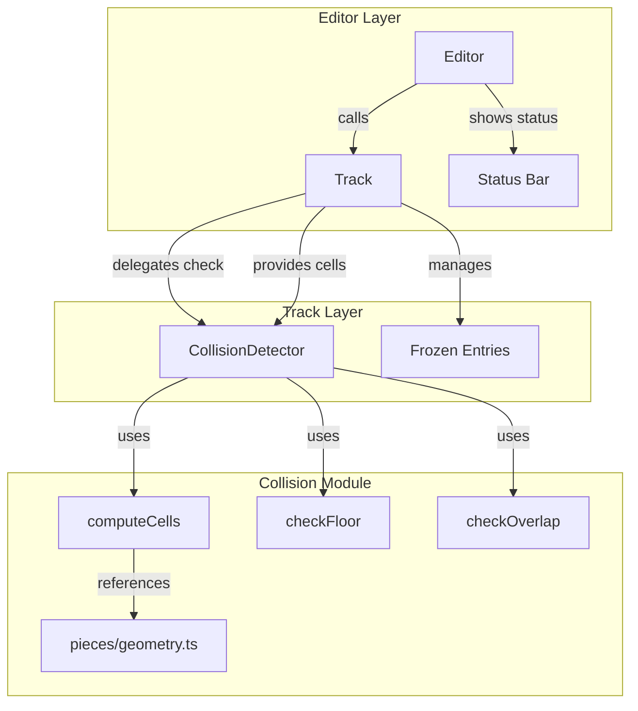
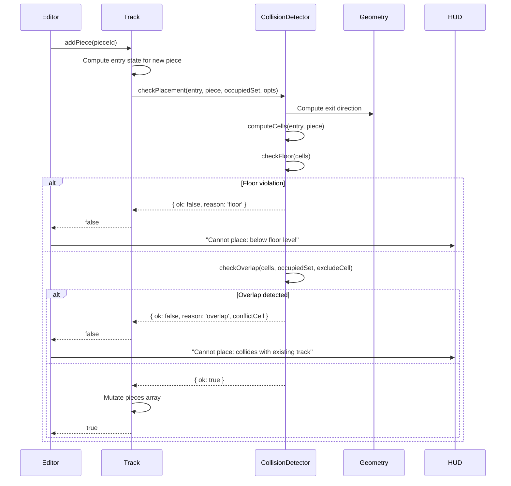

# Technical Design: Track Collision Detection

## Overview

This design introduces a collision detection module (`src/collision.ts`) that prevents users from building invalid tracks by detecting two categories of violations:

1. **Floor violations**: Track segments that descend below the floor level (gz < 0)
2. **Overlap violations**: Track segments that occupy the same 3D grid cells as existing track segments

The module integrates with the existing `Track` class methods (`addPiece`, `insertAt`, `replaceAt`) to enforce constraints at placement time, and provides structured error results that the `Editor` translates into user-facing status messages.

A key feature is **auto-detection of frozen region collisions**: when the user is rebuilding a track section after a deletion (editing mode with frozen entries), the system automatically checks new placements against the downstream frozen pieces, preventing accidental building over the track segments that still exist after the edit point.

### Design Goals

- **Pure computation**: The collision detector is a pure-function module with no side effects, making it highly testable
- **O(1) cell lookups**: Use a `Set<string>` keyed by serialized `(gx, gy, gz)` tuples for constant-time overlap checks
- **Minimal coupling**: The detector takes input data (entry state, piece, existing cells) and returns a result — it does not directly mutate the track
- **Frozen region awareness**: Automatically includes frozen region cells in overlap checks during editing mode

## Architecture



### Data Flow for a Placement Check



## Components and Interfaces

### New Module: `src/collision.ts`

This module exports pure functions for cell computation, floor checking, and overlap detection.

```typescript
import type { Dir, GridState, Piece } from './types.js';

/**
 * A serialized cell key for Set-based O(1) lookups.
 * Format: "gx,gy,gz"
 */
export type CellKey = string;

/**
 * A 3D grid cell tuple.
 */
export interface GridCell {
  gx: number;
  gy: number;
  gz: number;
}

/**
 * Result of a collision check.
 */
export type CollisionResult =
  | { ok: true }
  | { ok: false; reason: 'floor'; cell: GridCell }
  | { ok: false; reason: 'overlap'; cell: GridCell };

/**
 * Options for the placement check.
 */
export interface CheckPlacementOpts {
  /** Cells occupied by pieces in the checked region */
  occupiedCells: Set<CellKey>;
  /** The cell to exclude from overlap checks (connection point with predecessor) */
  excludeCell: CellKey | null;
}

/**
 * Serialize a grid cell to a string key for Set membership tests.
 */
export function cellKey(gx: number, gy: number, gz: number): CellKey;

/**
 * Compute the occupied grid cells for a piece placed at the given entry state.
 *
 * Algorithm:
 * 1. Compute exit direction: (entry.dir + piece.turn + 4) % 4
 * 2. For i in 0..piece.forward-1:
 *    - gx = entry.gx + DIRS[exitDir].dx * i
 *    - gy = entry.gy + DIRS[exitDir].dy * i
 *    - gz = Math.round(entry.gz + (piece.dz * i / piece.forward))
 * 3. Return array of GridCell
 */
export function computeCells(entry: GridState, piece: Piece): GridCell[];

/**
 * Check if any cell has gz < 0 (floor violation).
 */
export function checkFloor(cells: GridCell[]): GridCell | null;

/**
 * Check if any cell overlaps with the occupied set, excluding the connection point.
 */
export function checkOverlap(
  cells: GridCell[],
  occupied: Set<CellKey>,
  excludeCell: CellKey | null
): GridCell | null;

/**
 * Full placement check: floor first, then overlap.
 */
export function checkPlacement(
  entry: GridState,
  piece: Piece,
  opts: CheckPlacementOpts
): CollisionResult;

/**
 * Build the occupied cell set for a range of pieces in the track.
 * Used to construct the "checked region" set.
 */
export function buildOccupiedSet(
  pieces: PieceId[],
  startState: GridState,
  fromIndex: number,
  toIndex: number
): Set<CellKey>;

/**
 * Build the occupied cell set for frozen-suffix pieces using their snapshot entries.
 */
export function buildFrozenOccupiedSet(
  pieces: PieceId[],
  frozenEntries: GridState[],
  frozenBoundary: number
): Set<CellKey>;
```

### Modified: `src/track.ts`

The Track class integrates collision detection into its mutation methods:

```typescript
// New imports
import { checkPlacement, buildOccupiedSet, buildFrozenOccupiedSet, cellKey, computeCells } from './collision.js';
import type { CollisionResult } from './collision.js';

export class Track {
  // ... existing fields ...

  /**
   * Result of the last collision check. The Editor reads this to
   * determine the appropriate error message. Reset on every mutation attempt.
   */
  lastCollisionResult: CollisionResult | null = null;

  /**
   * Build the occupied cell set for the "checked region" based on current mode.
   * - Normal mode: all pieces
   * - Editing mode: live region + frozen region cells
   */
  private _buildCheckedCells(excludeIndex?: number): Set<CellKey>;

  /**
   * Get the connection-point exclusion cell for a piece at the given index.
   * This is the exit cell of the preceding piece (which is the same as
   * the entry cell of the candidate).
   */
  private _getExcludeCell(index: number): CellKey | null;

  // Modified: addPiece, insertAt, replaceAt now call checkPlacement before mutating
  addPiece(pieceId: string): boolean;
  insertAt(index: number, pieceId: PieceId): boolean;
  replaceAt(index: number, pieceId: PieceId): boolean;

  // Modified: rejoin now validates the connection point
  rejoin(): boolean; // returns false if mismatch detected
}
```

### Modified: `src/editor.ts`

The Editor reads `track.lastCollisionResult` after a failed operation to show the appropriate message:

```typescript
// In the _add method and related paths:
private _add(id: PieceId): void {
  // ... existing logic ...
  const ok = this.track.addPiece(id); // or insertAt/replaceAt
  if (!ok) {
    const result = this.track.lastCollisionResult;
    if (result && !result.ok) {
      if (result.reason === 'floor') {
        this._setStatus('Cannot place: piece would go below floor level.', 'err');
      } else if (result.reason === 'overlap') {
        this._setStatus('Cannot place: collides with existing track.', 'err');
      }
    }
    return;
  }
  // ... rest of success path ...
}
```

## Data Models

### GridCell

```typescript
interface GridCell {
  gx: number;  // integer grid X coordinate
  gy: number;  // integer grid Y coordinate
  gz: number;  // integer grid Z coordinate (elevation)
}
```

### CellKey (Set storage format)

A string serialization of `GridCell` for O(1) Set lookups:
```typescript
type CellKey = string; // format: "gx,gy,gz" e.g. "3,2,1"
```

The `cellKey` function serializes: `cellKey(gx, gy, gz) => `${gx},${gy},${gz}``

### CollisionResult (discriminated union)

```typescript
type CollisionResult =
  | { ok: true }
  | { ok: false; reason: 'floor'; cell: GridCell }
  | { ok: false; reason: 'overlap'; cell: GridCell };
```

### CheckPlacementOpts

```typescript
interface CheckPlacementOpts {
  occupiedCells: Set<CellKey>;    // pre-built set of all cells in checked region
  excludeCell: CellKey | null;    // connection point to exclude from overlap
}
```

### Cell Computation Algorithm

For a piece with entry state `E` and piece definition `P`:

1. **Exit direction**: `exitDir = (E.dir + P.turn + 4) % 4`
2. **Direction vector**: `dv = DIRS[exitDir]` → `{ dx, dy }`
3. **For each cell index `i` from 0 to `P.forward - 1`**:
   - `gx = E.gx + dv.dx * i`
   - `gy = E.gy + dv.dy * i`
   - `gz = Math.round(E.gz + (P.dz * i / P.forward))`
4. **Result**: Array of `GridCell` with exactly `P.forward` elements

The `gz` interpolation uses `i / P.forward` (not `i / (P.forward - 1)`) because the entry cell is at height `E.gz` (at i=0) and the exit cell (which is the *next* piece's entry, not part of this piece's cells) would be at `E.gz + P.dz`. The last owned cell (at `i = P.forward - 1`) has `gz = Math.round(E.gz + P.dz * (P.forward - 1) / P.forward)`.

### Occupied Set Construction

**Normal mode** (no frozen entries):
```
occupiedSet = union of computeCells(entryStateAt(i), PIECES[pieces[i]]) for all i in 0..pieces.length-1
```

**Editing mode** (frozen entries active):
```
liveSet = union of computeCells(computeEntryAt(i), PIECES[pieces[i]]) for i in 0..frozenBoundary-1
frozenSet = union of computeCells(frozenEntries[j], PIECES[pieces[frozenBoundary + j]]) for j in 0..frozenEntries.length-1
occupiedSet = liveSet ∪ frozenSet
```

### Connection Point Exclusion

When checking piece at index `k`, the connection point is the exit of piece `k-1`, which equals the entry of piece `k`. This cell is excluded from overlap checks because sequential pieces naturally share their connection point.

```
excludeCell = cellKey(entry.gx, entry.gy, entry.gz)  // the entry cell itself
```

Wait — actually the entry cell IS one of the candidate's cells (cell at i=0). The predecessor's last cell (at i=forward-1) may or may not coincide with this entry. Let me reconsider:

The predecessor's cells go from its entry to `entry + (forward-1) * exitDir`. The *next* piece's entry is `applyPiece(predecessor_entry, predecessor)`, which is `predecessor_entry + forward * exitDir`. So the predecessor's last cell is one step *before* the candidate's entry cell. They do NOT overlap.

Therefore **no exclusion is needed** — the cell computation ensures no overlap at the connection point by design. The entry cell of piece N is always one step beyond the last cell of piece N-1.

Let me verify with a STRAIGHT (forward=1, facing East, entry at (0,0,0)):
- Cells: [(0,0,0)] (only i=0)
- Next entry via applyPiece: (1,0,0) — one step ahead

So piece 0 occupies (0,0,0), piece 1's entry is (1,0,0), and piece 1 occupies (1,0,0). These are distinct. ✓

**No connection-point exclusion logic is needed.** The cell computation naturally avoids overlap at connection points.

## Correctness Properties

*A property is a characteristic or behavior that should hold true across all valid executions of a system — essentially, a formal statement about what the system should do. Properties serve as the bridge between human-readable specifications and machine-verifiable correctness guarantees.*

### Property 1: Floor Violation Detection

*For any* piece and entry GridState where the effective starting elevation incorporates the drop height, if the exit gz (entry.gz + piece.dz) is less than 0, or if any intermediate cell (computed by linear interpolation entry.gz + piece.dz × i / piece.forward for i in 1..forward-1) has gz < 0, then `checkPlacement` SHALL return `{ ok: false, reason: 'floor' }`.

**Validates: Requirements 1.1, 1.2, 1.3, 1.5, 6.1, 6.3, 6.4**

### Property 2: Cell Computation Correctness

*For any* piece definition with forward value N and any valid entry GridState, `computeCells(entry, piece)` SHALL produce exactly N cells where cell_i = (entry.gx + DIRS[exitDir].dx × i, entry.gy + DIRS[exitDir].dy × i, Math.round(entry.gz + piece.dz × i / N)) for exitDir = (entry.dir + piece.turn + 4) % 4.

**Validates: Requirements 2.2, 2.3, 2.5, 5.1, 5.2, 5.3**

### Property 3: Cell Computation Consistency with applyPiece

*For any* piece and entry GridState, the first cell returned by `computeCells` SHALL equal (entry.gx, entry.gy, entry.gz), and the position one exitDir step beyond the last cell SHALL equal the (gx, gy) of `applyPiece(entry, piece)`, with the exit gz at entry.gz + piece.dz.

**Validates: Requirements 5.5**

### Property 4: Overlap Detection Rejects Colliding Placements

*For any* track configuration and candidate piece whose computed cells have at least one CellKey present in the occupied set, `checkPlacement` SHALL return `{ ok: false, reason: 'overlap' }`, and the Track's `addPiece`/`insertAt`/`replaceAt` methods SHALL return false without modifying the pieces array.

**Validates: Requirements 2.1, 3.1, 3.2, 3.3, 3.5, 3.6, 3.7**

### Property 5: 3D Cell Identity — Elevation Separation

*For any* two pieces whose occupied cells share (gx, gy) coordinates but differ in gz values, `checkOverlap` SHALL NOT report a collision, since CellKey incorporates the gz component.

**Validates: Requirements 2.6, 5.4**

### Property 6: Rejection Atomicity

*For any* track state and any piece placement attempt that is rejected by the collision detector, the track's pieces array, frozenEntries state, and editing mode SHALL be identical before and after the rejected call.

**Validates: Requirements 3.4, 4.4**

### Property 7: Frozen Region Auto-Detection

*For any* track in editing mode (frozenEntries non-null), if a new piece placed in the live region has computed cells that overlap with cells occupied by frozen-suffix pieces (computed from their snapshot entry states), then the placement SHALL be rejected.

**Validates: Requirements 7.1, 7.2, 7.4**

### Property 8: Rejoin Mismatch Detection

*For any* track in editing mode where the live region's final exit GridState does not match the frozen region's first entry GridState, calling `rejoin()` SHALL return false and keep editing mode active (frozenEntries remains non-null).

**Validates: Requirements 7.6**

### Property 9: Valid Placements Accepted

*For any* piece and entry GridState where all computed cells have gz >= 0 AND no computed cell exists in the occupied set, `checkPlacement` SHALL return `{ ok: true }` and the Track mutation method SHALL succeed and add the piece to the array.

**Validates: Requirements 1.3, 2.7, 6.4**

## Error Handling

### Collision Detection Errors

| Scenario | Detection Point | Result | User Message |
|----------|----------------|--------|--------------|
| Exit gz < 0 | `checkFloor` | `{ ok: false, reason: 'floor', cell }` | "Cannot place: piece would go below floor level." |
| Intermediate cell gz < 0 | `checkFloor` | `{ ok: false, reason: 'floor', cell }` | "Cannot place: piece would go below floor level." |
| Cell overlaps live region | `checkOverlap` | `{ ok: false, reason: 'overlap', cell }` | "Cannot place: collides with existing track." |
| Cell overlaps frozen region | `checkOverlap` | `{ ok: false, reason: 'overlap', cell }` | "Cannot place: collides with downstream track." |
| Rejoin mismatch | `rejoin()` | returns false | "Cannot rejoin: track doesn't connect. Keep building or undo." |

### Error Priority

Floor violations are checked **before** overlap violations. If a piece has both a floor violation and an overlap, the floor violation is reported (it's a more fundamental constraint).

### Edge Cases

- **Empty track**: First piece is always accepted w.r.t. overlap (occupied set is empty). Floor check still applies.
- **Drop height change**: Existing pieces are NOT re-validated. Only new placements are checked against current effective elevation.
- **Replace operation**: The old piece's cells are excluded from the occupied set before checking the replacement piece.
- **Frozen region empty after deletions**: If all frozen pieces have been deleted, editing mode ends naturally (`_maybeEndEdit`), and normal overlap checking resumes.

## Testing Strategy

### Property-Based Tests (using `fast-check`)

The feature is well-suited to property-based testing because:
- Cell computation is a pure function with a wide input space (any GridState × any Piece)
- Floor/overlap detection is a pure predicate over sets
- The correctness properties are universally quantified

**Library**: `fast-check` (TypeScript property-based testing library)
**Configuration**: Minimum 100 iterations per property test
**Tag format**: `Feature: track-collision-detection, Property {N}: {description}`

Each correctness property (1–9) will have a corresponding property-based test with custom arbitraries for:
- `GridState` generator: random gx/gy in [-10, 10], gz in [0, 6], dir in [0, 3]
- `Piece` generator: select from PIECES catalogue
- `Track` generator: random sequence of valid placements from start state

### Unit Tests (example-based)

| Test | Validates |
|------|-----------|
| STRAIGHT at (0,0,0,E) → cells = [(0,0,0)] | Req 5.2 |
| CORKSCREW (fwd=3) at (0,0,0,E) → cells = [(0,0,0), (1,0,0), (2,0,0)] | Req 5.3 |
| CURVE_R at (0,0,0,E) → cells = [(0,1,0)] (steps along exit dir S) | Req 2.5 |
| RAMP_DN at gz=0 → floor violation | Req 1.1 |
| SPIRAL (fwd=2, dz=-2) at gz=1 → intermediate gz check | Req 1.2 |
| Two pieces at same (gx,gy) different gz → no collision | Req 2.6 |
| Frozen region overlap detection during editing mode | Req 7.1 |
| Rejoin with mismatched states keeps editing mode | Req 7.6 |
| Drop height = 3, RAMP_DN accepted (effective gz = 3 + (-1) = 2 ≥ 0) | Req 6.4 |
| Rejected placement leaves track unchanged | Req 3.4 |
| Editor shows "floor" message on floor violation | Req 4.1 |
| Editor shows "collides" message on overlap | Req 4.2 |
| replaceAt excludes old piece's cells from check | Req 3.3 |

### Integration Tests

| Test | Validates |
|------|-----------|
| Build a U-turn track (4 right curves) and verify 5th piece is rejected if it would overlap | Req 2.1, 3.1 |
| Delete middle piece, build into gap, verify can't overlap frozen downstream | Req 7.1, 7.2 |
| Full editing workflow: delete → build → rejoin success | Req 7.5 |
| Full editing workflow: delete → build wrong → rejoin fails | Req 7.6 |
